# Proffer Brand Guide v2 & Design System Reference

This skill provides the complete and updated brand identity, design tokens, component patterns, and visual hierarchy rules for the Proffer application (v2 - based on the new Brandbook). Use it as the single source of truth when building or reviewing any UI.

---

## 1. Brand Identity & Personality

**Product**: Proffer — a platform focused on pricing intelligence and market analytics, making it accessible from small retail to large industries. 

**Core Values**:
- **Inovação**: Breaking from discomfort, directing towards simpler/optimistic scenarios.
- **Conhecimento**: Storing and applying information to find the best solutions.
- **Desenvolvimento**: Constant evolution, small steps leading to future conquests.
- **Conectividade**: Discovering needs and supplying them; strong connections.

**Archetypes**:
- **Cientista** (Scientist): Materiality, Research, Skill. Values knowledge, science to solve problems.
- **Estrategista** (Strategist): Planning, Structure, Organization. Anticipates problems, segments the world.

**Voice & Tone**: Confident, Approachable, Clear, Proactive, Adaptable.

---

## 2. Color Palette

All colors are established by the Proffer Brandbook. Use them strictly to ensure visual recognition and harmony.

### 🟢 Primary Palette (Foundation)
This is the visual foundation of the brand. *Verde Escuro* is the dominant color (50% usage), while *Verde Claro* and *Branco* act as support colors (25-50% usage).

| Color Name | Hex Value | RGB | CMYK | Usage |
|---|---|---|---|---|
| **Verde Escuro** | `#0A3033` | `10, 48, 51` | 83-36-48-66 | Primary dominant color, hero blocks, backgrounds. |
| **Verde Claro** | `#A8D727` | `168, 215, 39` | - | Primary CTA, highlights, active states. |
| **Branco** | `#EAF4F5` | `234, 244, 245` | - | General backgrounds, contrast color. |

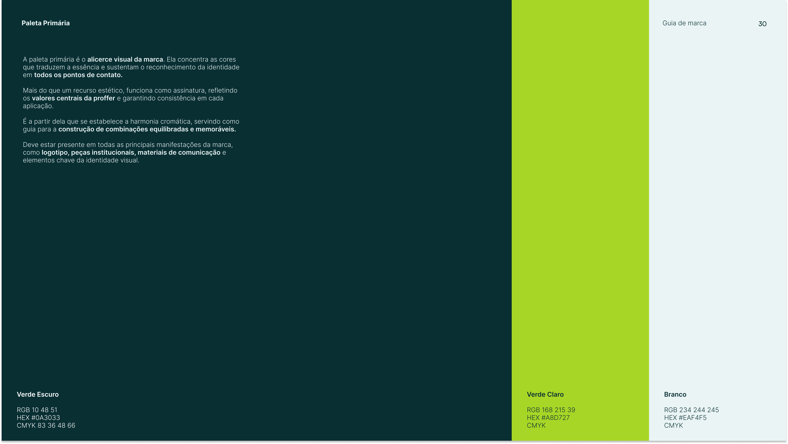

### 📊 Secondary Palette (Sub-brands & Categorization)
Used to give identity to Proffer's sub-brands (Farmácias, Mercados, Varejo, Indústria, Distribuição) and for data visualization/charts where multiple categories are needed. Avoid exceeding 10-15% of the overall visual composition.

| Vertical | Color Name | Hex Value | RGB | CMYK |
|---|---|---|---|---|
| **Farmácias** | Verde Farmácias | `#05D16E` | `5, 209, 110` | 89-0-60-0 |
| **Mercados** | Amarelo Mercados | `#F5B704` | `245, 183, 4` | 0-25-100-0 |
| **Varejo** | Azul Varejo | `#23B7AC` | `35, 183, 172` | 75-0-35-0 |
| **Indústria** | Laranja Indústria | `#FD7721` | `253, 119, 33` | 0-55-100-0 |
| **Distribuição** | Violeta Distribuição| `#AB84F7` | `171, 132, 247`| 38-47-0-0 |

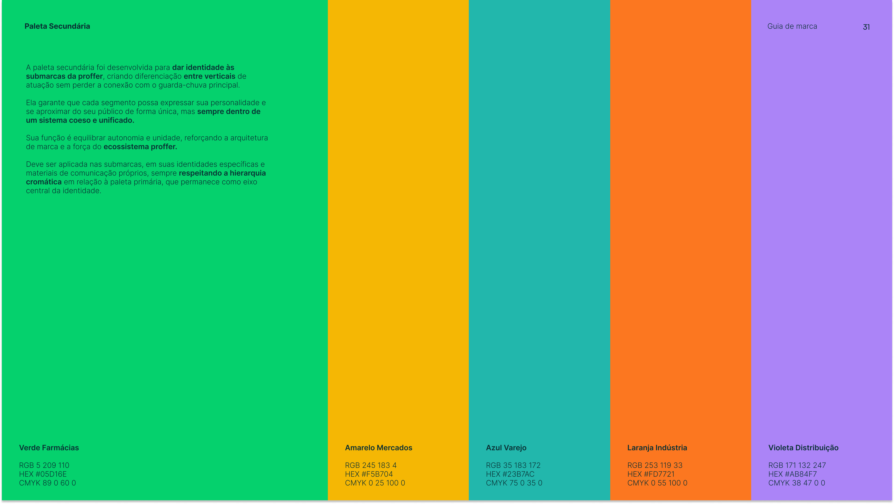

### 🛠 Extended UI Palette
Developed for digital environments, interfaces, interactive elements (buttons, hover states, errors), ensuring accessibility and contrast.

| Family | Base/500 | 400 (Lighter) | 600 (Darker) | 700 (Darkest) |
|---|---|---|---|---|
| **Verde (Farmácia)** | `#5DFBAE` | `#8EFCC7` | `#22F991` | - |
| **Amarelo (Mercado)**| `#FDD96F` | `#FDE59B` | `#FCCC3B` | - |
| **Azul (Varejo)** | `#76E5DD` | `#A0EDE8` | `#44DBD1` | - |
| **Laranja (Indús.)** | `#FFA970` | `#FFC39B` | `#FF8A3C` | `#FF6400` |
| **Violeta (Distrib.)** | `#AF93DD` | `#C7A9F6` | `#9D69EF` | - |
| **Vermelho (Erro)** | `#F99678` | `#FBB6A1` | `#F77047` | `#F5430D` |
| **Azul** | `#75C8E6` | `#9FD9ED` | `#43B4DD` | `#228FB8` |

**Neutral / Light Tints**:
- Cinza: `950: #1A1A1A`, `900: #333333`, `800: #808080`, `700: #fefefe`
- Verde Claro shades: `2: #BDE15A`, `3: #CEE986`, `4: #DDF0AB`
- Branco shades: `2: #DAF1F3`, `3: #C4DEE0`

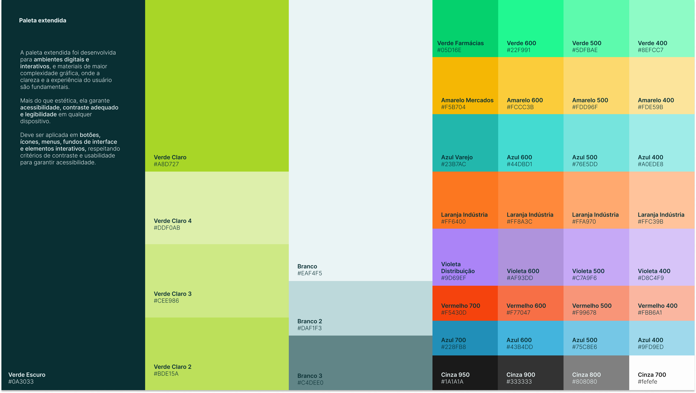

---

## 3. Typography

The identity is built exactly on two typefaces: **Satoshi** (for Titles) and **Inter** (for Body text).

### 🏷 Titles & Numbers: Satoshi
Used for bold titles, giving unity to new brands, and excellent readability for data/numbers/indicators.
- **Weights**: Light, Regular, Medium, Bold, Black
- Never use for long text blocks.

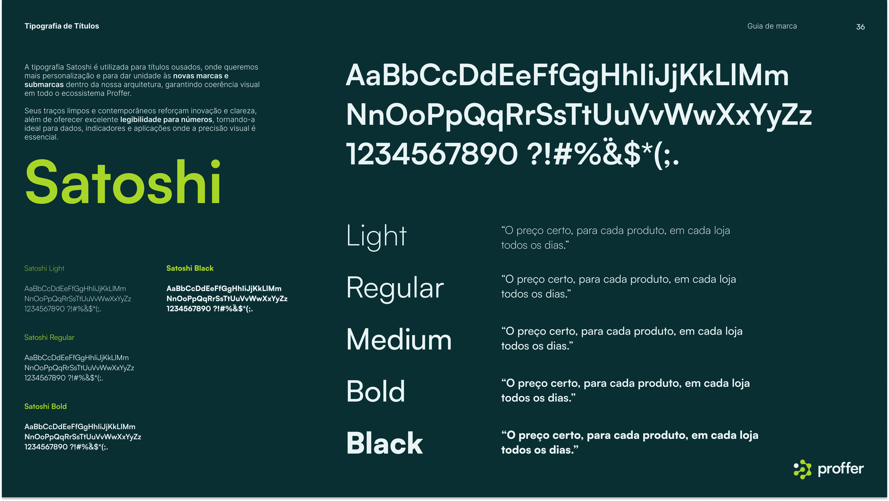

### 📝 Body Text & UI: Inter
Adopted for institutional texts, descriptions, subtitles, buttons, and interfaces. Ensures clarity in digital environments.
- **Weights**: Light, Regular, Medium, SemiBold (for buttons/CTAs), Bold, Black.
- Does not replace Satoshi for primary headings or key data numbers.

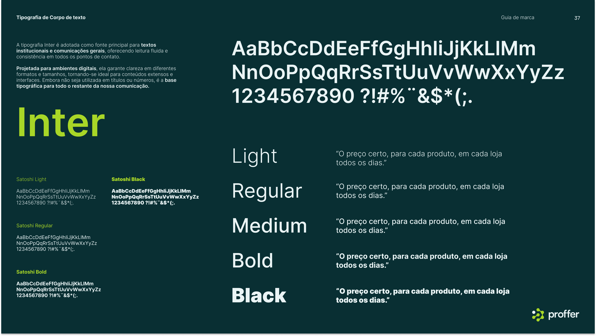

### 📌 Typography Hierarchy Rules
```css
/* Titles */
H1 (Page Title)    → Satoshi Medium
H2 / H3            → Satoshi Regular or Medium

/* Subheads & Body */
Subheaders         → Inter Bold or Regular, 100% line-height
Body               → Inter Light or Regular
Buttons & CTAs     → Inter Semibold
```

---

## 4. Logo & Visual Applications

### Logo Usage & Protection Area
- The logo consists of the **Símbolo** and the **Logotipo**.
- The symbol represents connecting dots turning data into decisions.
- **Never** use the symbol isolated except in extremly reduced applications (like favicons or very tight UI constraints) where the marketing team authorized it. 
- Minimum size: Digital `180px` width (Favicon `48px`).

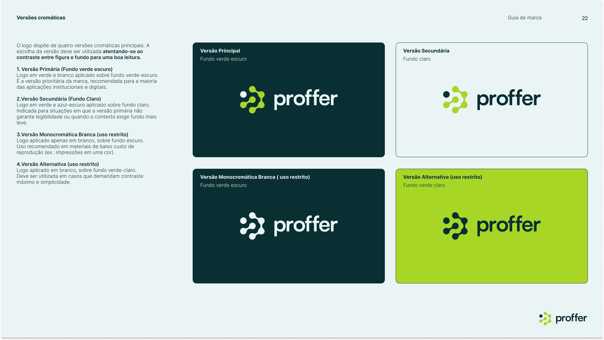

### Composition & Graphics
- **Photography**: Always reflects confidence, dynamism, proximity. Uses "Dutch angles" or "Low angles", natural light, modern backgrounds.
- **Graphic Elements**: The UI can use patterns based on the circular connections of the logo. Icons and data "balões" can be added to photos to bring technology into human spaces.

---

## 5. UI Application Rules & Do's / Don'ts

### ✅ DO
- Always use the **Verde Escuro (`#0A3033`)** as the background for primary applications.
- Always use **Satoshi** for headers and key numbers in dashboards, and **Inter** for UI controls.
- Use the **Extended UI Palette** for hover states or alert messages (e.g. Vermelho `700` for destructive actions).
- Keep layouts clean, utilizing substantial white-space (respiro) to maintain an organized, "Scientist" / "Strategist" aesthetic.

### ❌ DON'T
- Do not use old generic colors like `#739D23` or `#254000` (from v1). The brand identity has fundamentally changed.
- Do not rotate, stretch, or apply shadows/outlines/glows to the logo.
- Do not use the Primary *Verde Claro* on a White background if it hurts accessibility (check contrast). Use Verde Escuro instead.

---

## 6. CSS Reference Implementation

```css
:root {
  /* Primary Foundation */
  --proffer-verde-escuro: #0A3033;
  --proffer-verde-claro: #A8D727;
  --proffer-branco: #EAF4F5;
  
  /* Sub-brands */
  --proffer-verde-farmacias: #05D16E;
  --proffer-amarelo-mercados: #F5B704;
  --proffer-azul-varejo: #23B7AC;
  --proffer-laranja-industria: #FD7721;
  --proffer-violeta-distribuicao: #AB84F7;
  
  /* Select Extended Colors */
  --proffer-erro-light: #FBB6A1;
  --proffer-erro: #F77047;
  --proffer-erro-dark: #F5430D;
  --proffer-cinza-950: #1A1A1A;
  --proffer-cinza-900: #333333;
  --proffer-cinza-800: #808080;
  
  --font-titles: 'Satoshi', sans-serif;
  --font-body: 'Inter', sans-serif;
}
```

---

## 7. UX Workspace & Prototype References

Based on the [Product UX Workspace Figma Prototype](https://www.figma.com/proto/94Iina4S6A58CeS9J1Oukk/Product---UX-Workspace), the following UI component specific patterns must be applied:

### Layout & Containers
- **Sidebar (Navigation)**: Uses a light gray/off-white background. The active menu item uses the primary *Verde Claro* (`#A8D727`) as a background highlight with dark text and rounded corners.
- **Cards & Data Modules**: White background (`#FFFFFF`), subtle thin gray borders, and larger border radius (e.g., `12px` to `16px`) for a soft, modern feel.
- **Main Area**: Generally uses a very light off-white or white background (`#F5F5F5` or `#FFFFFF`).

### Assistant & AI Elements (PrIA)
- **Mascot (PrIA)**: The platform features a 3D robot mascot (PrIA) with white and neon green details to humanize AI interactions.
- **Chat/Prompts**: The prominent AI search/prompt input box uses a strong dark green border (`Verde Escuro`) with a *Verde Claro* pill-shaped submit button inside it.
- **Chat Bubbles**: User messages use the *Verde Claro* background, while AI responses use a soft gray background.

### UI Components
- **Buttons**: Often pill-shaped or very rounded corners (`8px` to `12px` minimum). High-emphasis CTAs use `Verde Escuro` background with white text (`Branco`).
- **Icons**: Minimalist, thin "Line Art" style icons are used across the sidebar and inner card actions.
- **Inputs**: Text fields and search boxes maintain strong, dark borders for clarity, avoiding floating or borderless styles for primary inputs.
- **Pills / Tags**: Used for suggestion prompts (e.g., "O que é Curva ABC?"). They have rounded pill shapes, transparent backgrounds, and thin dark borders.

### Referências Visuais do Protótipo

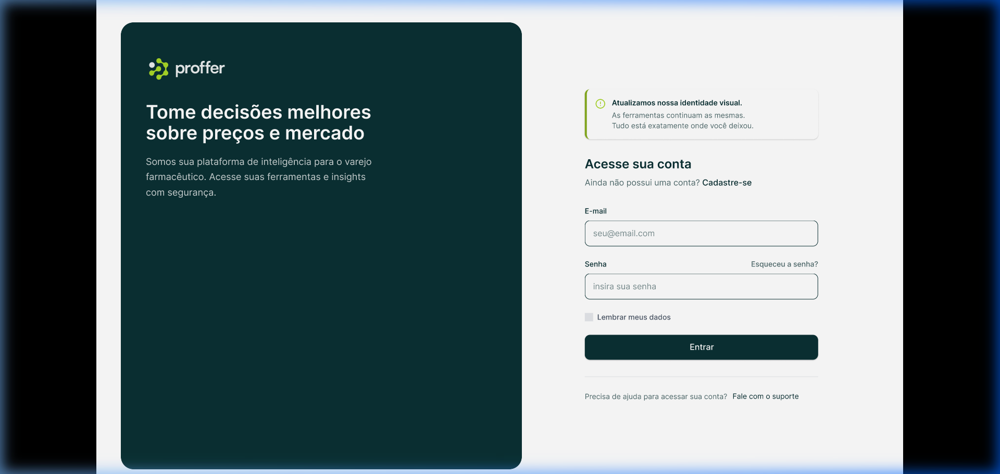

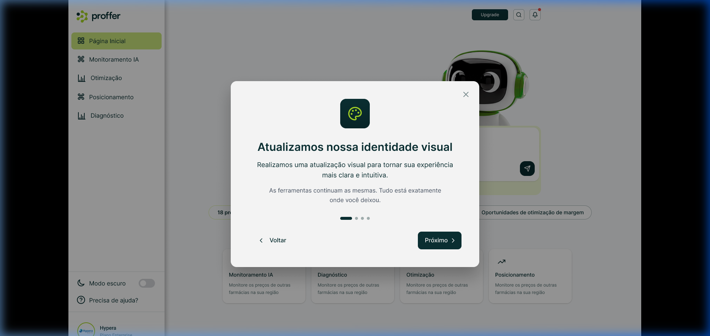
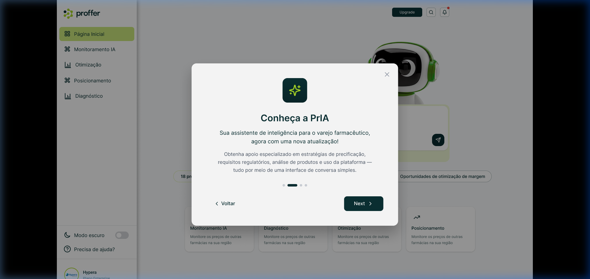
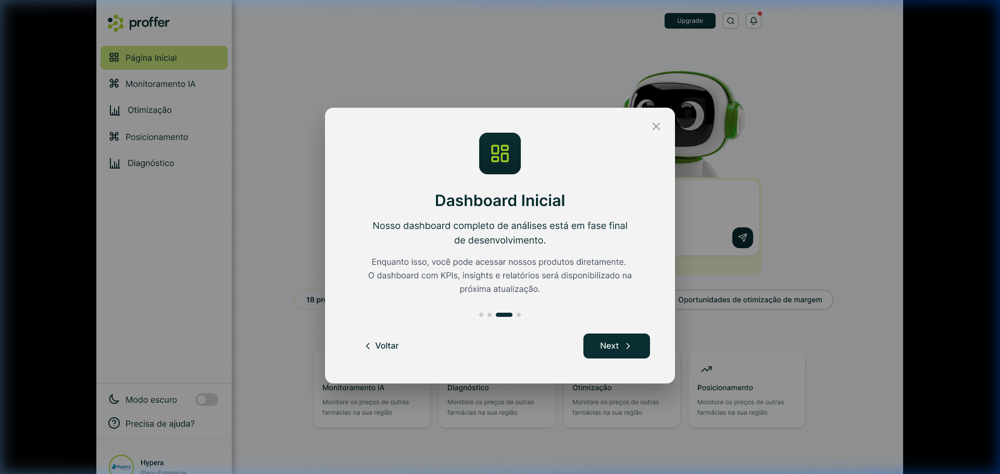
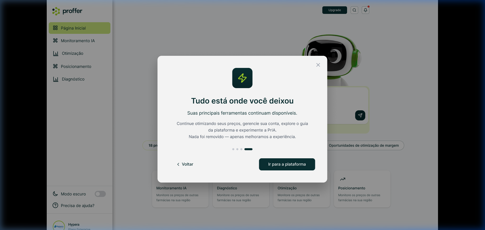
