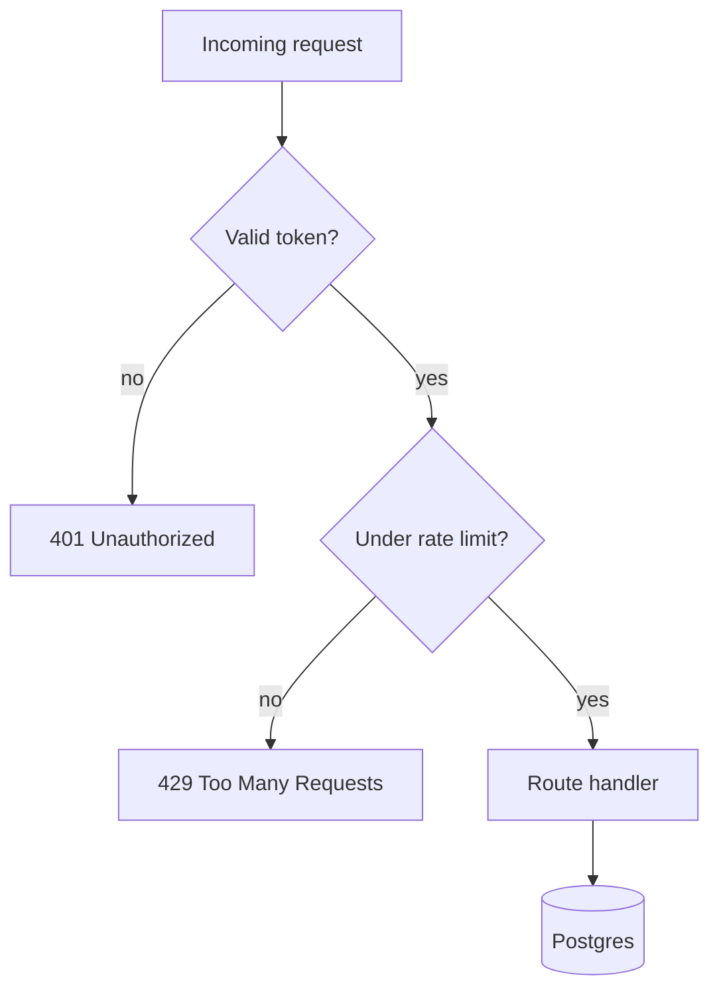
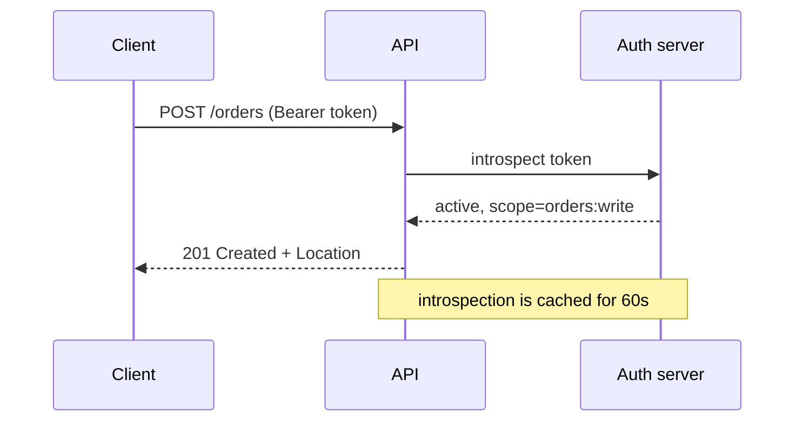
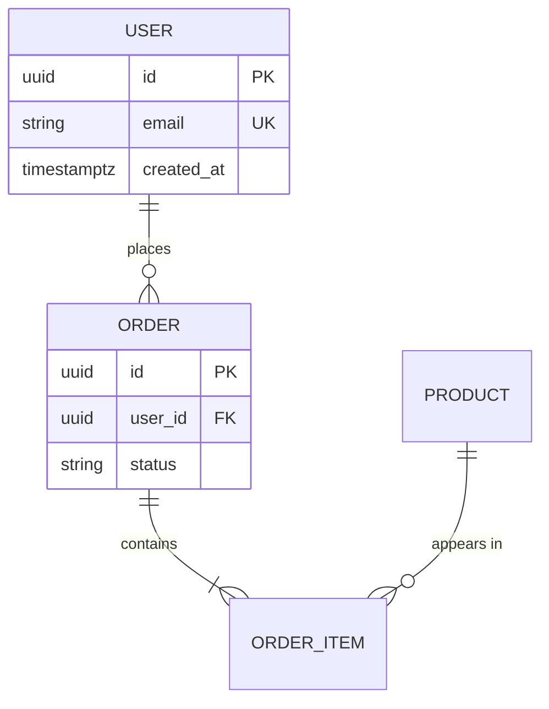
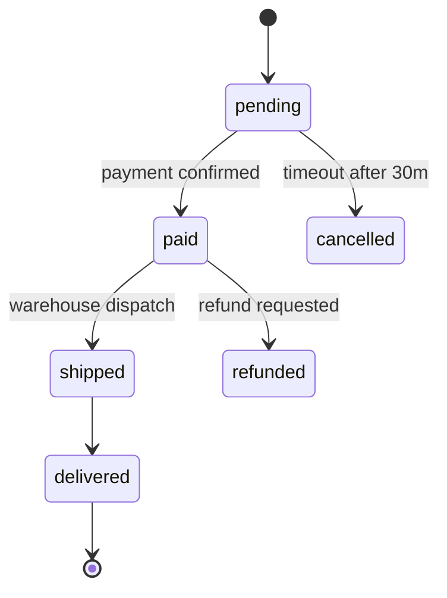
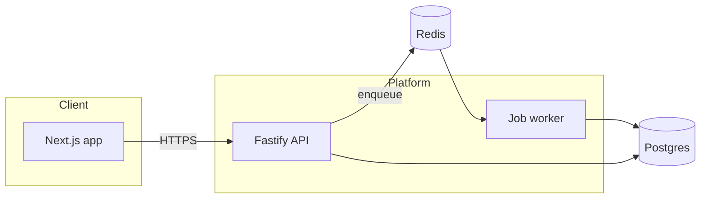

# Mermaid diagrams

A diagram earns its place when the relationship is the point — order of calls, branching, ownership
of data. If a sentence says it, write the sentence.

## Picking the type

| You need to show | Use |
|---|---|
| A decision or a process with branches | `flowchart` |
| Who calls whom, in what order, over time | `sequenceDiagram` |
| Tables and their relationships | `erDiagram` |
| The states a thing moves through | `stateDiagram-v2` |
| Services and boundaries | `flowchart` with `subgraph` |
| Types and their relations | `classDiagram` |

Keep it under ~15 nodes. Past that, split into two diagrams or drop to prose — a wall of boxes
communicates less than a list.

## Flowchart

`TD` top-down, `LR` left-right. `[]` process, `{}` decision, `[()]` database, `(())` start/end.

## Sequence

`->>` call, `-->>` response, `-)` async with no reply. Use `activate`/`deactivate` only when the
lifetime of a call is the thing you're explaining.

## Entity relationship

Cardinality reads left-to-right: `||` exactly one, `o{` zero or many, `|{` one or many.

## State

## Architecture with boundaries

## Rules that keep diagrams readable

- Label every edge that isn't obvious — an unlabeled arrow is a guess
- One direction per diagram; mixed flow directions read as noise
- Name nodes as they're named in the code, so the diagram is greppable
- Skip custom colors unless a color carries meaning; the default theme adapts to light and dark
- Put the diagram next to the prose it supports, never as the only explanation — screen readers and
  diffs both need the text
